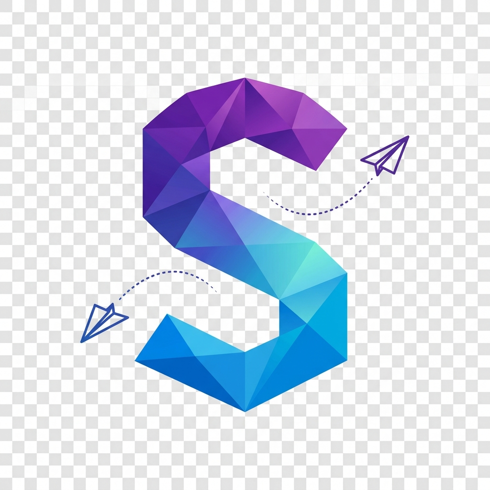

<p align="center">
  
</p>

<h1 align="center">✨ SmartLife ✨</h1>

<p align="center">
  
  
  
  
  
</p>

<p align="center">
  <b>SmartLife</b> adalah modern mobile app yang menyatukan personal finance, real-time chat, pengingat, dan AI assistance dalam satu connected experience yang terpadu.
</p>

---

## 🌟 Overview

**SmartLife** bukan sekadar standard finance tracker biasa. Ini adalah life management workspace di mana pengguna bisa:

- 💰 **Manage spending & budget bulanan** dengan praktis
- 🎯 **Monitor savings goals & recurring subscriptions** secara real-time
- 💬 **Chatting & sharing multimedia** secara instan
- 🤖 **Dapatkan AI-powered financial insights** yang cerdas
- 📊 **Tetap terorganisir** lewat satu central dashboard yang intuitif

---

## 🔥 Fitur Utama | Core Features

### 1. ⚡ Smart Dashboard
Hub sentral untuk monitor finance snapshot, pengingat, dan akses cepat ke AI entry points.

### 2. 💳 Finance & Wealth
Lacak transaksi secara detail, pantau budget progress, dan kelola savings goals langsung dari satu menu.

### 3. 💬 Realtime Chat
One-to-one messaging menggunakan Socket.io dengan fitur pencarian, reaksi, share multimedia, dan online status indicator.

### 4. 🧠 SmartLife AI
Smart financial assistant yang didukung Gemini untuk memberikan actionable advice berdasarkan konteks transaksi kamu.

### 5. 🔐 Auth & Security
Alur autentikasi yang clean dengan dukungan Google Sign-In dan desain UI yang secure serta modern.

---

## 🛠️ Tech Stack

### 📱 Mobile (Frontend)
- **Framework**: Flutter & Dart
- **State Management**: Riverpod (Functional & Reactive)
- **Local Database**: Hive (Lightning Fast)
- **Networking**: Client Socket.IO & Dio
- **Animations**: Flutter Animate

### 💻 Backend (API)
- **Runtime**: Node.js & Express.js
- **Database**: MongoDB dengan Mongoose
- **Real-time**: Socket.io Server
- **AI Engine**: Gemini AI API
- **Auth**: JWT & Bcrypt encryption

---

## 🚀 Getting Started | Cara Memulai

### 1. Prasyarat | Prerequisites
- Flutter SDK 3.x & Dart SDK
- Node.js 18+ (Recommended)
- MongoDB Atlas atau Local
- Gemini API Key

### 2. Instalasi | Installation
```bash
# Clone the repository
git clone https://github.com/f1qxzz/SmartApp.git
cd SmartApp

# Run Backend
cd backend
npm install
npm run dev

# Run Mobile
cd ../mobile
flutter pub get
flutter run
```

---

## 💎 Key Highlights
- **Clean Architecture**: Kode terstruktur yang gampang di-maintain dan di-skala.
- **Glassmorphism UI**: Tampilan transparan yang memberikan kesan premium & modern vibe.
- **Fluid Animations**: Transisi yang smooth berkat flutter_animate.

---

## 📄 License
Project ini dilisensikan di bawah Lisensi MIT.
*This project is licensed under the MIT License.*

<p align="center">
  
  
  <br />
  Made with ❤️ by [@f1qxzz](https://github.com/f1qxzz)
</p>
