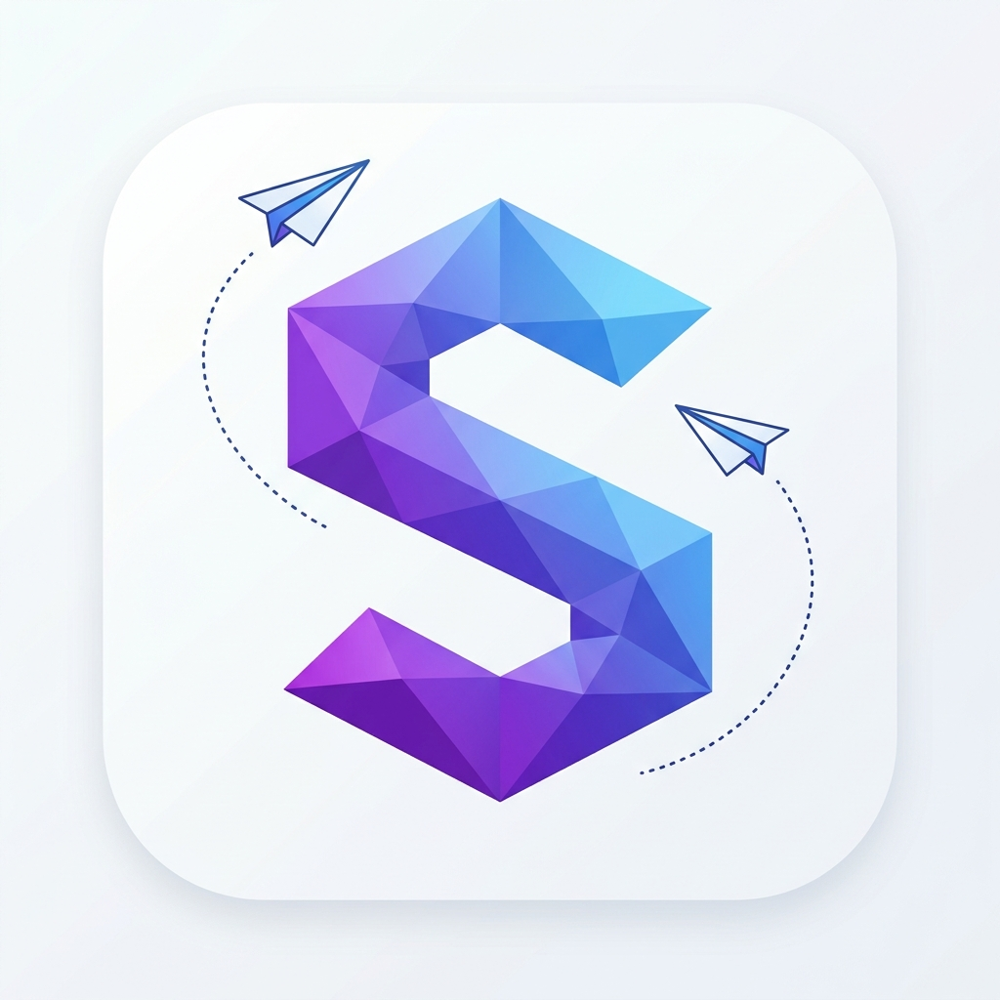

# <p align="center">✨ SmartLife — The Ultimate SuperApp ✨</p>

<p align="center">
  
  
  
  
  
</p>

<p align="center">
  <b>SmartLife</b> adalah aplikasi superapp modern yang menggabungkan manajemen keuangan cerdas, komunikasi real-time, dan asisten AI dalam satu antarmuka premium yang memukau.
  <br />
  <i><b>SmartLife</b> is a modern superapp that combines smart finance management, real-time communication, and AI assistance in one stunning premium interface.</i>
</p>

<p align="center">
  <a href="https://github.com/f1qxzz/SmartApp/releases/latest">
    
  </a>
</p>

---

## 🚀 Fitur Utama | Key Features

| 💰 Finance Tracker | 💬 Real-time Chat | 🤖 AI Assistant | 🏠 Smart Home |
| :--- | :--- | :--- | :--- |
| Kelola pengeluaran & tabungan dengan grafik interaktif. | Ngobrol instan dengan dukungan multimedia & status online. | Analisa keuangan & saran cerdas berbasis AI. | Kontrol perangkat rumah pintar langsung dari ponsel. |
| *Manage expenses & savings with interactive charts.* | *Instant chat with multimedia support & online status.* | *AI-powered financial analysis & smart suggestions.* | *Control smart home devices directly from your phone.* |

---

## 💎 Key Highlights

> [!IMPORTANT]
> **SmartLife** bukan sekadar template UI. Ini adalah fondasi aplikasi *production-ready* yang mengutamakan performa dan keamanan.

- 🛠️ **Clean Architecture**: Pemisahan layer Domain, Data, dan Presentation yang ketat untuk skalabilitas maksimal.
- ⚡ **Riverpod Driven**: State management reaktif yang memudahkan pengujian dan pemeliharaan kode.
- 🔒 **Secure Offline Storage**: Menggunakan Hive yang dienkripsi untuk menyimpan data sensitif secara lokal.
- 🎨 **Pixel Perfect Design**: Implementasi sistem desain yang konsisten hingga ke detail terkecil.

---

## 🛡️ Performa & Keamanan | Performance & Security

| Feature | Description | Status |
| :--- | :--- | :---: |
| **JWT Authentication** | Autentikasi aman menggunakan JSON Web Tokens. | ✅ |
| **Data Encryption** | Enkripsi data sensitif pada penyimpanan lokal Hive. | ✅ |
| **Optimized Rendering** | Penggunaan `const` constructor dan pemisahan widget secara modular. | ✅ |
| **Input Sanitization** | Validasi dan pembersihan input pada sisi klien dan server. | ✅ |
| **Real-time Sync** | Sinkronisasi data instan melalui WebSockets (Socket.io). | ✅ |

---

## 🗺️ Roadmap Pengembangan | Roadmap

- [x] **v1.0**: Core features (Finance, Chat, Basic AI).
- [ ] **v1.1**: Integrasi Smart Home yang lebih mendalam dengan MQTT.
- [ ] **v1.2**: Dukungan Multi-bahasa (i18n) dinamis.
- [ ] **v1.3**: AI Voice Command (Perintah suara berbasis AI).
- [ ] **v1.4**: Widget Home Screen untuk Android & iOS.

---

## 🤝 Kontribusi | Contribution

Kontribusi selalu terbuka! Jika Anda memiliki ide atau menemukan bug, silakan buat *Pull Request* atau buka *Issue*.
*Contributions are always welcome! Feel free to open a Pull Request or create an Issue.*

1. Fork Repo ini.
2. Buat branch baru: `git checkout -b fitur-keren`.
3. Commit perubahan Anda: `git commit -m 'Menambah fitur keren'`.
4. Push ke branch: `git push origin fitur-keren`.
5. Buat Pull Request.

---

## 🎨 Tampilan Premium | Premium UI/UX

Aplikasi ini dirancang dengan standar desain tinggi menggunakan:
- **Glassmorphism**: Efek kaca transparan yang elegan.
- **Fluid Animations**: Transisi layar yang mulus dengan `flutter_animate`.
- **Dynamic Backgrounds**: *Mesh gradient* yang bergerak memberikan kesan luas dan premium.
- **Dark Mode Support**: Tema gelap yang dioptimalkan untuk kenyamanan mata.

---

## 🛠️ Stack Teknologi | Tech Stack

### Frontend (Mobile)
- **Framework**: Flutter 3.x
- **State Management**: Riverpod (Functional & Reactive)
- **Database Lokal**: Hive (NoSQL, Lightning Fast)
- **Animasi**: Flutter Animate & Lottie
- **Navigasi**: GoRouter

### Backend
- **Runtime**: Node.js
- **Framework**: Express.js
- **Database**: MongoDB (Mongoose)
- **Real-time**: Socket.io
- **AI Engine**: OpenAI API & Google Gemini API
- **Cloud Media**: Cloudinary

---

## 📂 Struktur Proyek | Project Structure

```text
smartlife_app/
├── mobile/                 # Flutter Application
│   ├── lib/
│   │   ├── core/           # Theme, Config, Utils
│   │   ├── domain/         # Entities & Logic
│   │   ├── presentation/   # Screens, Widgets, Providers
│   │   └── routes/         # App Routing
│   └── assets/             # Images & Fonts
└── backend/                # Node.js Server
    ├── src/
    │   ├── modules/        # Chat, Auth, Finance logic
    │   └── config/         # DB & API Config
    └── server.js           # Entry point
```

---

## 🏁 Memulai | Getting Started

### 📱 Frontend (Mobile)
1. Pergi ke direktori mobile: `cd mobile`
2. Install dependencies: `flutter pub get`
3. Buat file `.env` (copy dari `.env.example`) dan isi API-nya.
4. Jalankan aplikasi:
   ```bash
   flutter run
   ```

### 💻 Backend
1. Pergi ke direktori backend: `cd backend`
2. Install dependencies: `npm install`
3. Konfigurasi `.env` dengan kredensial MongoDB & API Keys.
4. Jalankan server:
   ```bash
   npm run dev
   ```

---

## 📸 Screenshots
<p align="center">
  
</p>

> [!TIP]
> **Pro Tip:** Gunakan perintah `flutter build apk --release` untuk mendapatkan performa animasi yang paling maksimal di perangkat fisik.

---

## 📄 Lisensi | License
Didistribusikan di bawah Lisensi MIT. Lihat `LICENSE` untuk informasi lebih lanjut.

---

<p align="center">
  
  
  <br />
  Made with ❤️ by @f1qxzz
</p>
