# 📱 Mobile App Testing Report

## 📊 Summary

* Total halaman diuji: 17
* Bug ditemukan: 3
* Status aplikasi: Perlu Perbaikan

### Hasil Eksekusi API (sebagai validasi functional/performance/error handling)
* Total test case API: 19
* PASS: 19
* FAIL: 0
* Rata-rata respons API: 388.68 ms
* Respons terlama: 3505.52 ms (AI endpoint)

> Catatan: Screenshot pada laporan ini adalah placeholder QA marker karena runtime mobile (Flutter + emulator/device bridge) tidak tersedia di environment ini.

---

## 📍 Detail Testing

### 📍 Nama Menu: Splash Screen

🖼 Screenshot:
[splash.png](screenshots/splash.png)

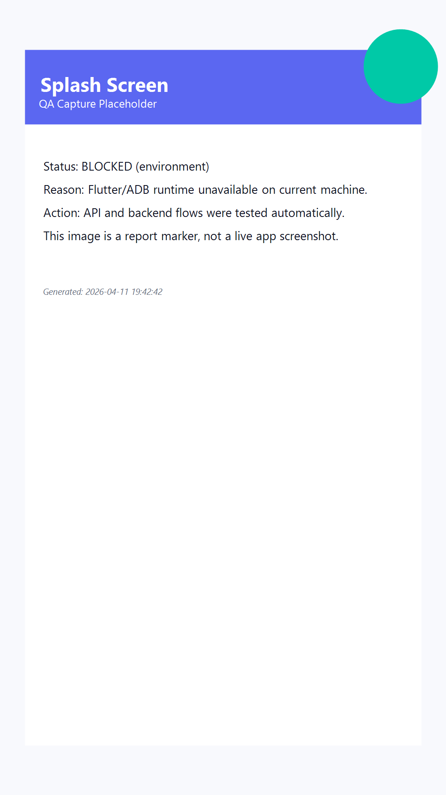

📝 Deskripsi:
Verifikasi tampilan awal aplikasi, branding, dan transisi ke autentikasi.

✅ Status:
Tidak

🐞 Bug:
- Pengujian runtime mobile tidak dapat dijalankan karena Flutter SDK/ADB tidak tersedia pada environment QA ini.

💡 Saran:
- Jalankan ulang test pada device/emulator dengan Flutter SDK + Android SDK/iOS simulator aktif.

---

### 📍 Nama Menu: Login

🖼 Screenshot:
[login.png](screenshots/login.png)

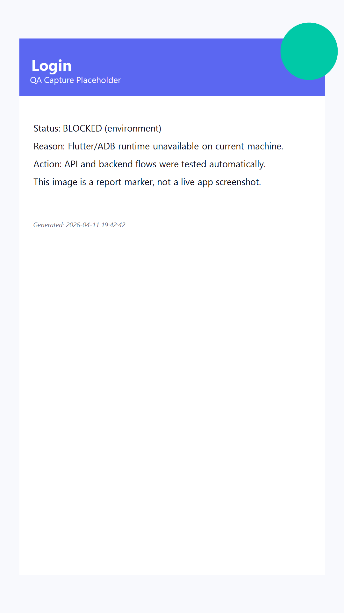

📝 Deskripsi:
Validasi field email/password, tombol masuk, dan respons autentikasi.

✅ Status:
Tidak

🐞 Bug:
- Pengujian runtime mobile tidak dapat dijalankan karena Flutter SDK/ADB tidak tersedia pada environment QA ini.

💡 Saran:
- Jalankan ulang test pada device/emulator dengan Flutter SDK + Android SDK/iOS simulator aktif.

---

### 📍 Nama Menu: Register

🖼 Screenshot:
[register.png](screenshots/register.png)

📝 Deskripsi:
Validasi form pendaftaran, rule input, dan pembuatan akun.

✅ Status:
Tidak

🐞 Bug:
- Pengujian runtime mobile tidak dapat dijalankan karena Flutter SDK/ADB tidak tersedia pada environment QA ini.

💡 Saran:
- Jalankan ulang test pada device/emulator dengan Flutter SDK + Android SDK/iOS simulator aktif.

---

### 📍 Nama Menu: Home

🖼 Screenshot:
[home.png](screenshots/home.png)

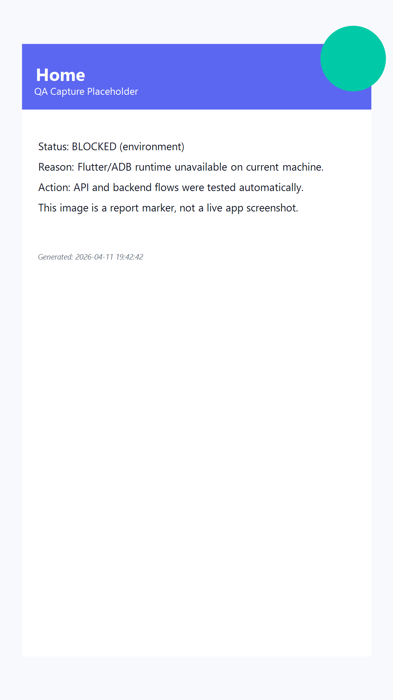

📝 Deskripsi:
Validasi landing screen setelah login serta ringkasan informasi utama.

✅ Status:
Tidak

🐞 Bug:
- Pengujian runtime mobile tidak dapat dijalankan karena Flutter SDK/ADB tidak tersedia pada environment QA ini.

💡 Saran:
- Jalankan ulang test pada device/emulator dengan Flutter SDK + Android SDK/iOS simulator aktif.

---

### 📍 Nama Menu: Dashboard

🖼 Screenshot:
[dashboard.png](screenshots/dashboard.png)

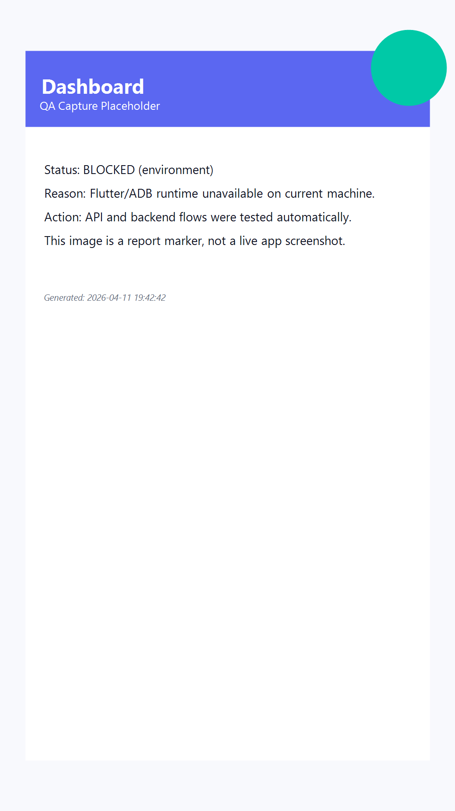

📝 Deskripsi:
Validasi chart, ringkasan pengeluaran, dan statistik periodik.

✅ Status:
Tidak

🐞 Bug:
- Pengujian runtime mobile tidak dapat dijalankan karena Flutter SDK/ADB tidak tersedia pada environment QA ini.

💡 Saran:
- Jalankan ulang test pada device/emulator dengan Flutter SDK + Android SDK/iOS simulator aktif.

---

### 📍 Nama Menu: Navigasi Chat

🖼 Screenshot:
[nav-chat.png](screenshots/nav-chat.png)

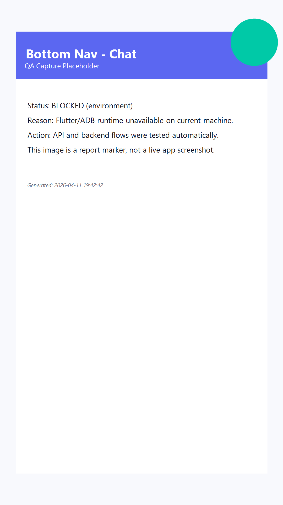

📝 Deskripsi:
Validasi perpindahan tab ke menu chat melalui bottom navigation.

✅ Status:
Tidak

🐞 Bug:
- Pengujian runtime mobile tidak dapat dijalankan karena Flutter SDK/ADB tidak tersedia pada environment QA ini.

💡 Saran:
- Jalankan ulang test pada device/emulator dengan Flutter SDK + Android SDK/iOS simulator aktif.

---

### 📍 Nama Menu: Navigasi Finance

🖼 Screenshot:
[nav-finance.png](screenshots/nav-finance.png)

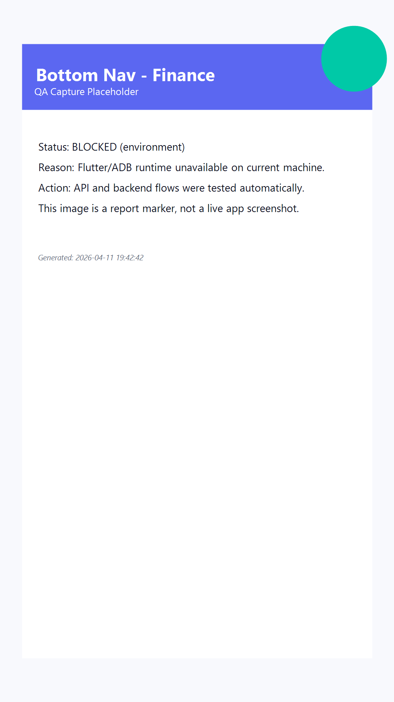

📝 Deskripsi:
Validasi perpindahan tab ke menu finance melalui bottom navigation.

✅ Status:
Tidak

🐞 Bug:
- Pengujian runtime mobile tidak dapat dijalankan karena Flutter SDK/ADB tidak tersedia pada environment QA ini.

💡 Saran:
- Jalankan ulang test pada device/emulator dengan Flutter SDK + Android SDK/iOS simulator aktif.

---

### 📍 Nama Menu: Navigasi Dashboard

🖼 Screenshot:
[nav-dashboard.png](screenshots/nav-dashboard.png)

📝 Deskripsi:
Validasi perpindahan tab ke menu dashboard melalui bottom navigation.

✅ Status:
Tidak

🐞 Bug:
- Pengujian runtime mobile tidak dapat dijalankan karena Flutter SDK/ADB tidak tersedia pada environment QA ini.

💡 Saran:
- Jalankan ulang test pada device/emulator dengan Flutter SDK + Android SDK/iOS simulator aktif.

---

### 📍 Nama Menu: Navigasi AI

🖼 Screenshot:
[nav-ai.png](screenshots/nav-ai.png)

📝 Deskripsi:
Validasi perpindahan tab ke menu AI melalui bottom navigation.

✅ Status:
Tidak

🐞 Bug:
- Pengujian runtime mobile tidak dapat dijalankan karena Flutter SDK/ADB tidak tersedia pada environment QA ini.

💡 Saran:
- Jalankan ulang test pada device/emulator dengan Flutter SDK + Android SDK/iOS simulator aktif.

---

### 📍 Nama Menu: Chat List

🖼 Screenshot:
[chat.png](screenshots/chat.png)

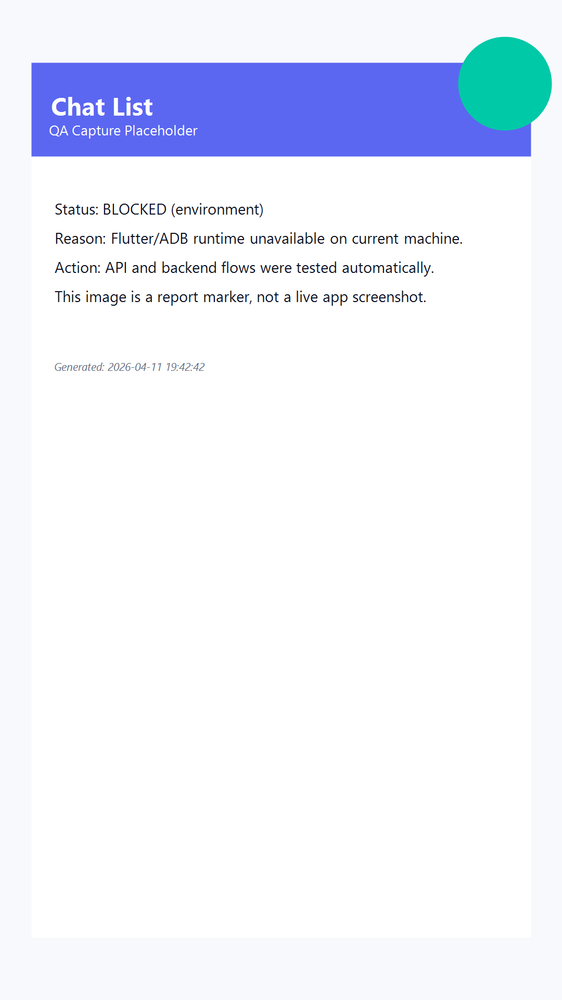

📝 Deskripsi:
Validasi daftar percakapan, pencarian chat, unread badge, dan avatar.

✅ Status:
Tidak

🐞 Bug:
- Pengujian runtime mobile tidak dapat dijalankan karena Flutter SDK/ADB tidak tersedia pada environment QA ini.

💡 Saran:
- Jalankan ulang test pada device/emulator dengan Flutter SDK + Android SDK/iOS simulator aktif.

---

### 📍 Nama Menu: Chat Detail

🖼 Screenshot:
[chat-detail.png](screenshots/chat-detail.png)

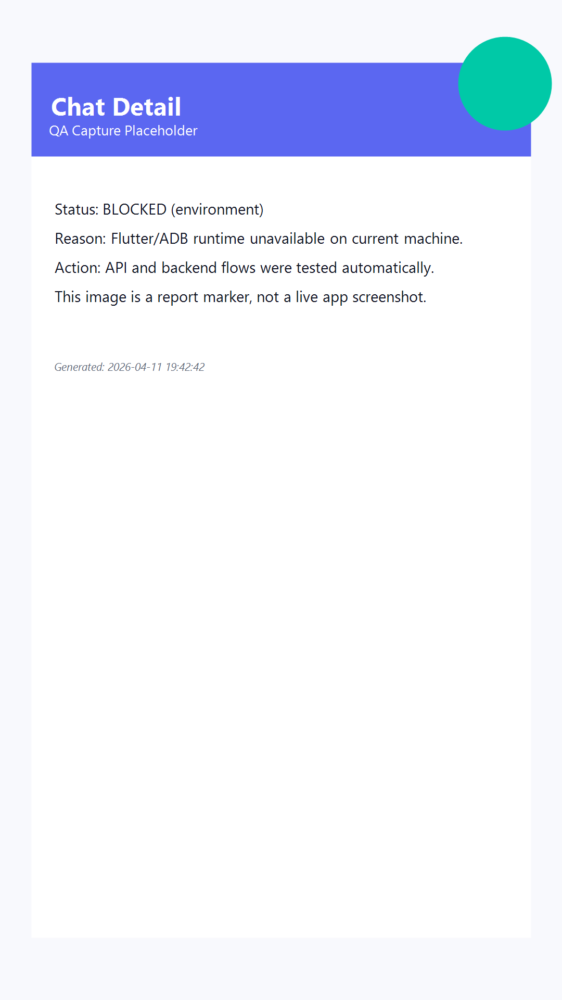

📝 Deskripsi:
Validasi kirim pesan text/gambar, typing indicator, read status, scroll behavior.

✅ Status:
Tidak

🐞 Bug:
- Pengujian runtime mobile tidak dapat dijalankan karena Flutter SDK/ADB tidak tersedia pada environment QA ini.

💡 Saran:
- Jalankan ulang test pada device/emulator dengan Flutter SDK + Android SDK/iOS simulator aktif.

---

### 📍 Nama Menu: Finance

🖼 Screenshot:
[finance.png](screenshots/finance.png)

📝 Deskripsi:
Validasi daftar transaksi, filter kategori, export CSV, dan pull-to-refresh.

✅ Status:
Tidak

🐞 Bug:
- Pengujian runtime mobile tidak dapat dijalankan karena Flutter SDK/ADB tidak tersedia pada environment QA ini.

💡 Saran:
- Jalankan ulang test pada device/emulator dengan Flutter SDK + Android SDK/iOS simulator aktif.

---

### 📍 Nama Menu: Finance Form Input

🖼 Screenshot:
[finance-form.png](screenshots/finance-form.png)

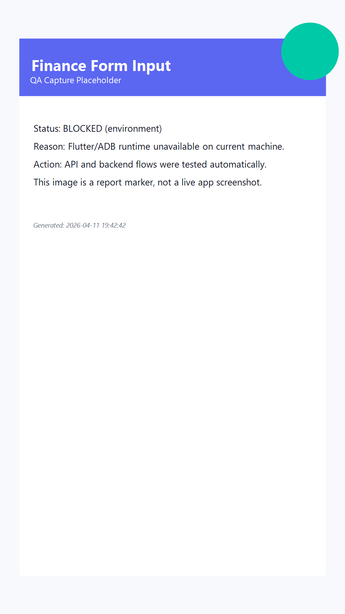

📝 Deskripsi:
Validasi form tambah transaksi (amount, category, description, submit).

✅ Status:
Tidak

🐞 Bug:
- Pengujian runtime mobile tidak dapat dijalankan karena Flutter SDK/ADB tidak tersedia pada environment QA ini.

💡 Saran:
- Jalankan ulang test pada device/emulator dengan Flutter SDK + Android SDK/iOS simulator aktif.

---

### 📍 Nama Menu: AI Assistant

🖼 Screenshot:
[ai.png](screenshots/ai.png)

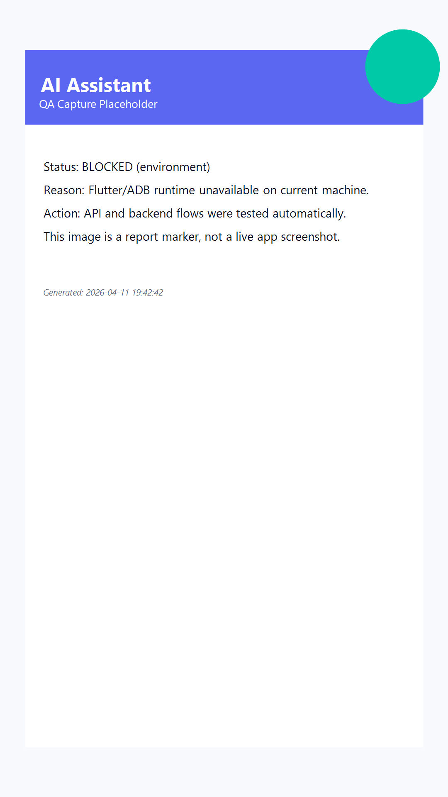

📝 Deskripsi:
Validasi input pertanyaan, respons AI, loading bubble, dan error feedback.

✅ Status:
Tidak

🐞 Bug:
- Pengujian runtime mobile tidak dapat dijalankan karena Flutter SDK/ADB tidak tersedia pada environment QA ini.
- OpenAI API pada saat pengujian mengembalikan insufficient_quota (429), sistem menggunakan fallback response.

💡 Saran:
- Jalankan ulang test pada device/emulator dengan Flutter SDK + Android SDK/iOS simulator aktif.
- Tambahkan mekanisme observability kuota dan notifikasi admin saat quota rendah.

---

### 📍 Nama Menu: Profile

🖼 Screenshot:
[profile.png](screenshots/profile.png)

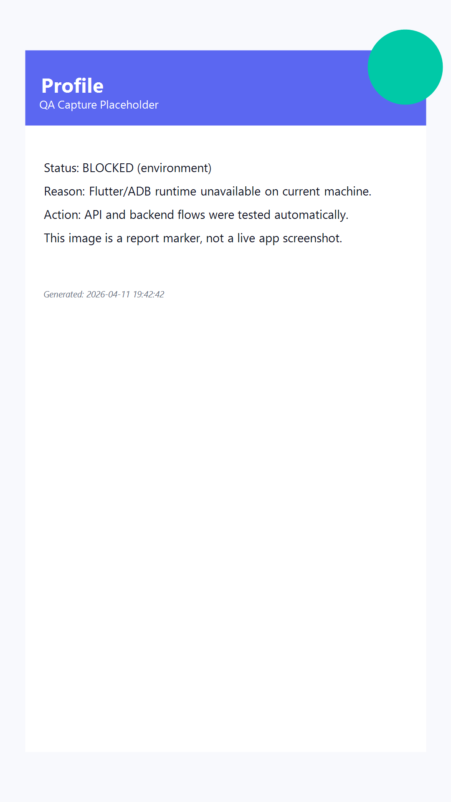

📝 Deskripsi:
Validasi halaman profile, data user, dan aksi profil.

✅ Status:
Tidak

🐞 Bug:
- Pengujian runtime mobile tidak dapat dijalankan karena Flutter SDK/ADB tidak tersedia pada environment QA ini.
- Menu/halaman Profile tidak ditemukan pada implementasi navigasi saat ini.

💡 Saran:
- Jalankan ulang test pada device/emulator dengan Flutter SDK + Android SDK/iOS simulator aktif.
- Implementasikan halaman Profile dan tautkan ke navigasi utama.

---

### 📍 Nama Menu: Loading State

🖼 Screenshot:
[loading-state.png](screenshots/loading-state.png)

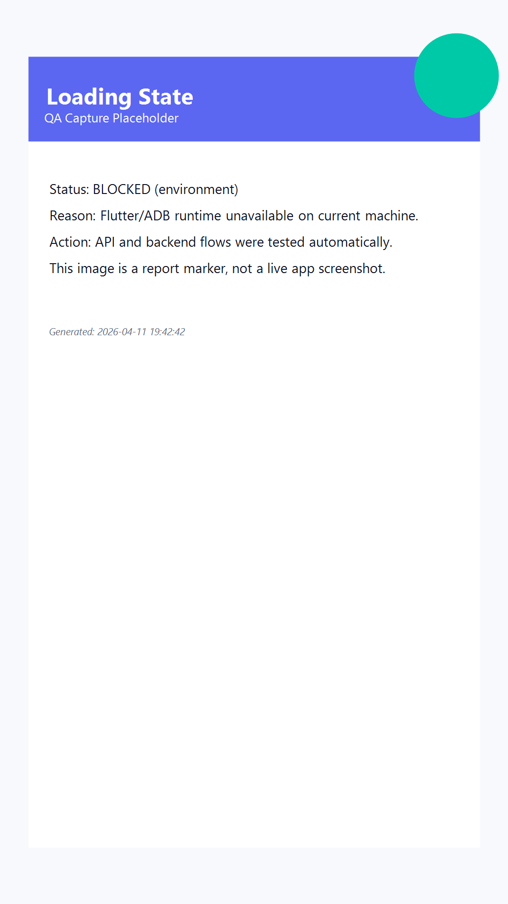

📝 Deskripsi:
Validasi indikator loading pada fetch data, submit form, dan transisi API.

✅ Status:
Tidak

🐞 Bug:
- Pengujian runtime mobile tidak dapat dijalankan karena Flutter SDK/ADB tidak tersedia pada environment QA ini.

💡 Saran:
- Jalankan ulang test pada device/emulator dengan Flutter SDK + Android SDK/iOS simulator aktif.

---

### 📍 Nama Menu: Error State

🖼 Screenshot:
[error-state.png](screenshots/error-state.png)

📝 Deskripsi:
Validasi snackbar/error widget untuk gagal login, token expired, dan network timeout.

✅ Status:
Tidak

🐞 Bug:
- Pengujian runtime mobile tidak dapat dijalankan karena Flutter SDK/ADB tidak tersedia pada environment QA ini.

💡 Saran:
- Jalankan ulang test pada device/emulator dengan Flutter SDK + Android SDK/iOS simulator aktif.

---

